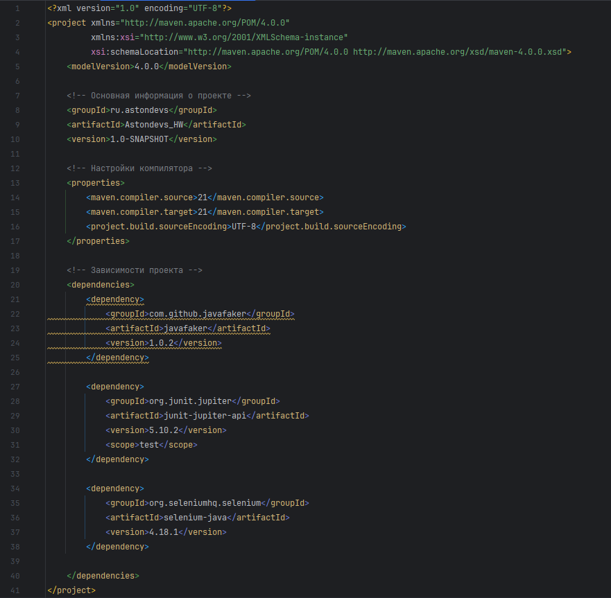
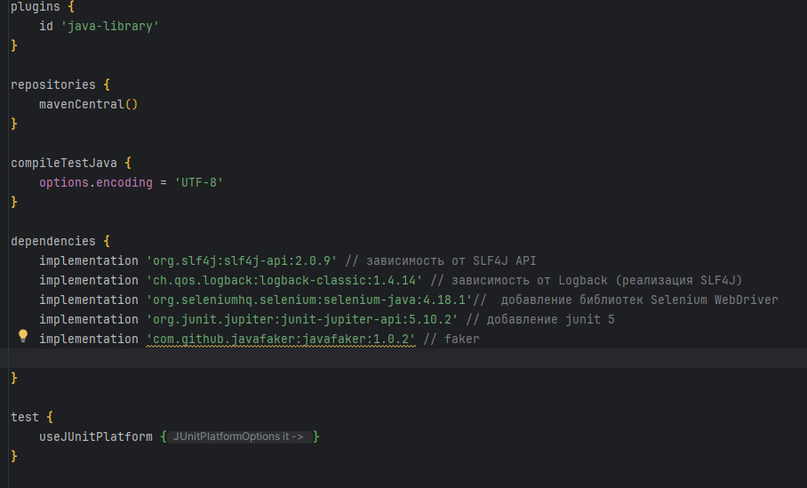

&nbsp;

# [Программа курса](README.md)

## Практическое задание

1. **Создайте две ветки: Lesson_11_maven и Lesson_11_gradle.**
   **В ветке Lesson_11_maven создайте проект, используя Maven с архетипом quickstart.**
   **В ветке Lesson_11_gradle создайте проект, используя Gradle.**
   **В каждый проект добавьте зависимости на такие инструменты как JUnit 5, Selenium.**

#### **Выполнение**

