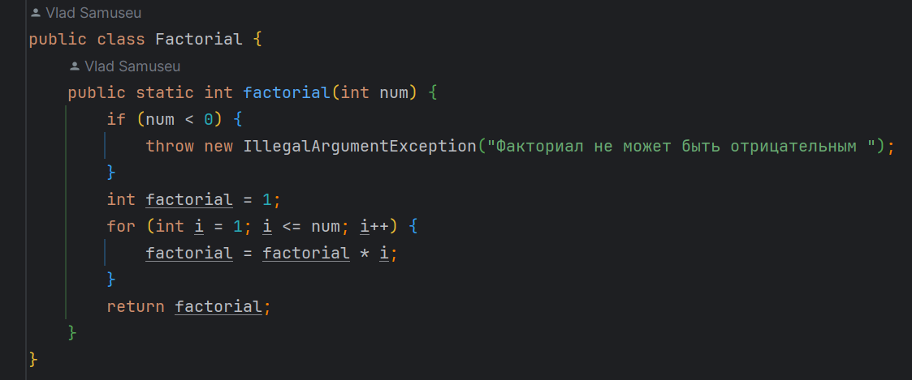
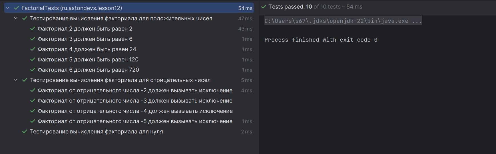

&nbsp;

# [Программа курса](README.md)

## Практическое задание

**Необходимо написать автотесты для сайта mts.by. Суть тестов заключается в проверке блока «Онлайн пополнение без комиссии»:**
1. **Проверить название указанного блока;**
2. **Проверить наличие логотипов платёжных систем;**
3. **Проверить работу ссылки «Подробнее о сервисе»;**
4. **Заполнить поля и проверить работу кнопки «Продолжить» (проверяем только вариант «Услуги связи», номер для теста 297777777)**

#### **Выполнение**

#### **Результат**
