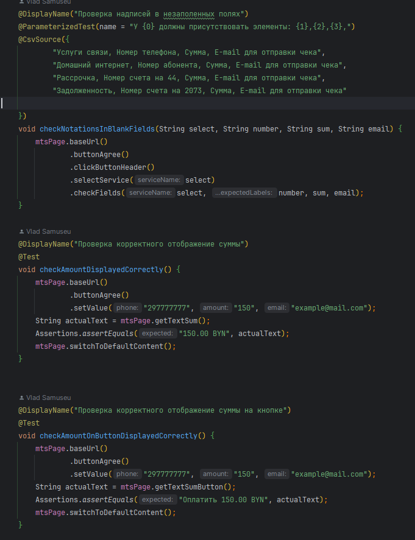
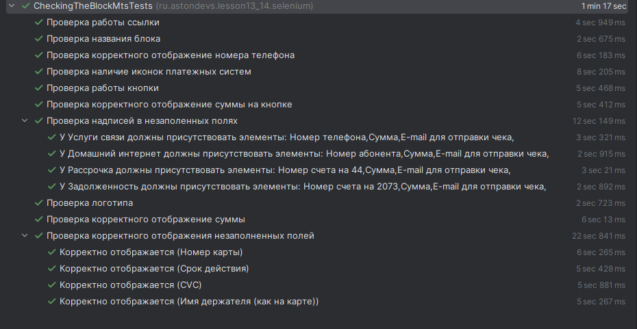

&nbsp;

# [Программа курса](README.md)

## Практическое задание

**Продолжим работу над блоком «Онлайн пополнение без комиссии» сайта mts.by**

1. **Проверить надписи в незаполненных полях каждого
   варианта оплаты услуг: услуги связи, домашний
   интернет, рассрочка, задолженность;**
2. **Для варианта «Услуги связи» заполнить поля в
   соответствии с пререквизитами из предыдущей темы,
   нажать кнопку «Продолжить» и в появившемся окне
   проверить корректность отображения суммы (в том
   числе на кнопке), номера телефона, а также надписей в
   незаполненных полях для ввода реквизитов карты,
   наличие иконок платёжных систем.**

#### **Выполнение**

#### **Результат**

