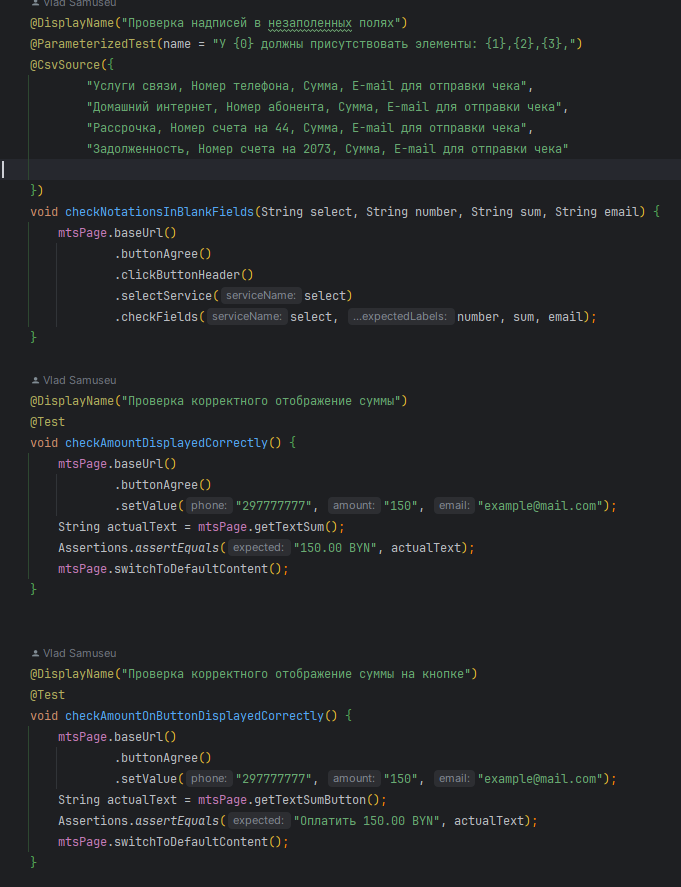
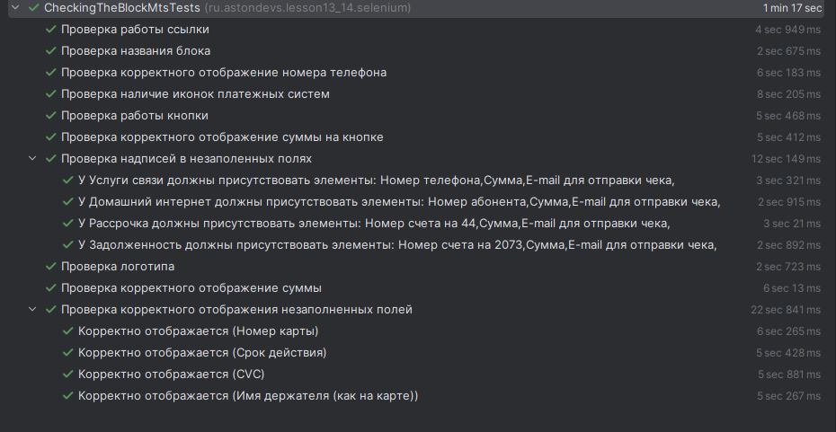

&nbsp;

# [Программа курса](README.md)

## Практическое задание

**Написать автотесты для сайта wildberries.ru, в ходе которых
на главной странице несколько товаров кладется в корзину,
затем осуществляется переход в корзину и происходят
проверки на соответствие названия товаров, их количество,
цен каждого товара в корзине и общей суммы товаров.
При написании автотестов необходимо использовать
подходящие паттерны, изученные в данной теме.**

#### **Выполнение**

#### **Результат**

