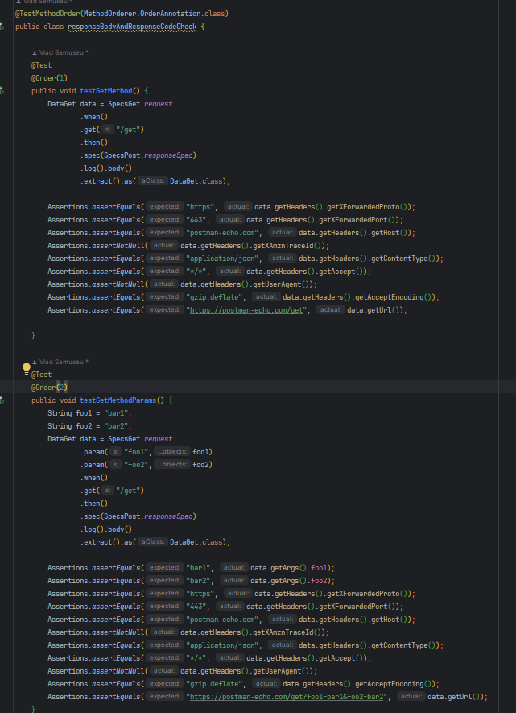
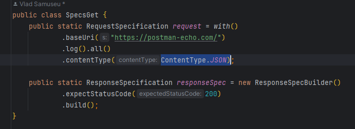
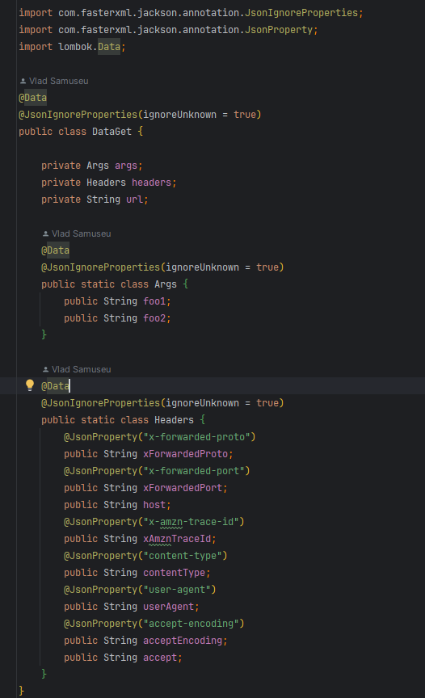
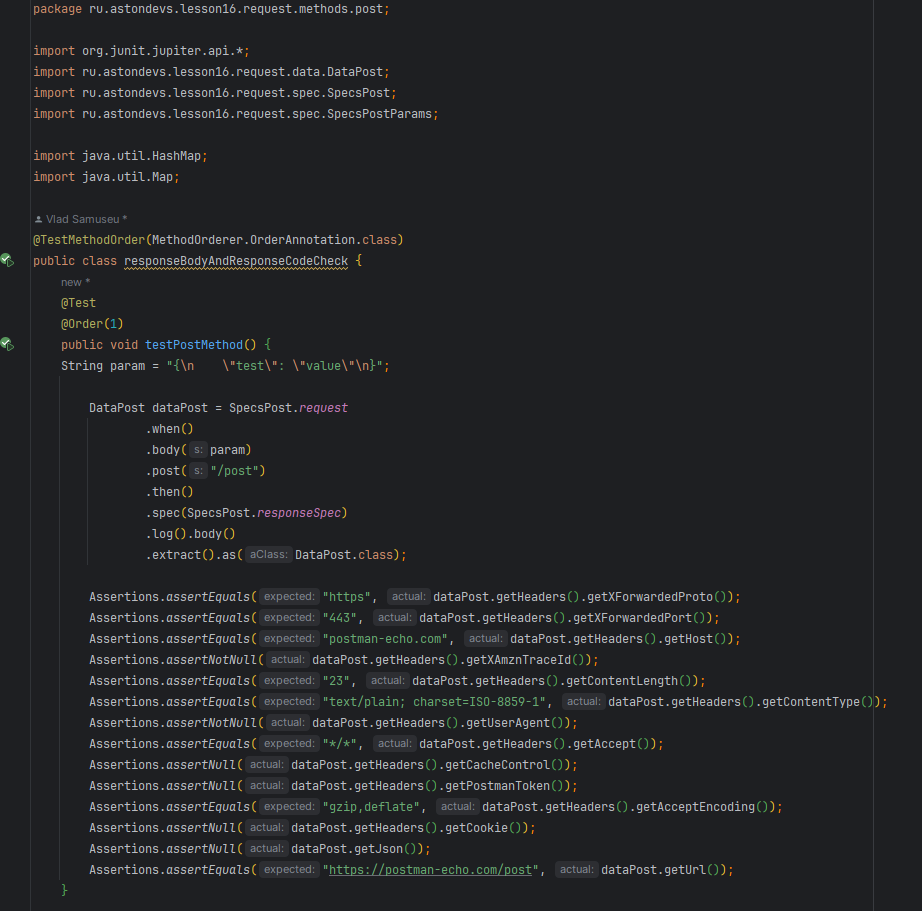
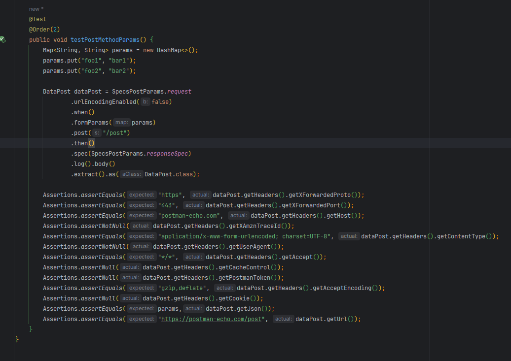
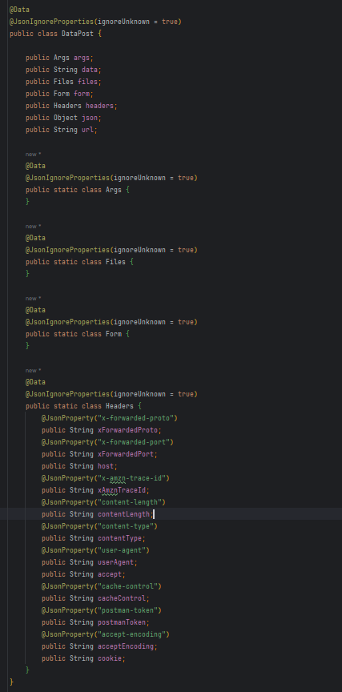
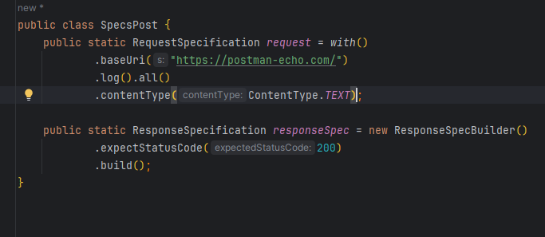
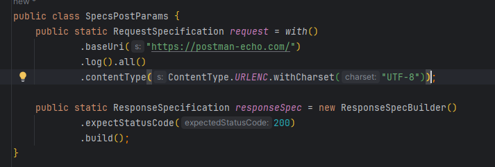

&nbsp;

# [Программа курса](README.md)

## Практическое задание

**Перейдите в сервис Postman.
Войдите в свой аккаунт и скачайте себе коллекцию Postman
Echo.
Написать автотесты для каждого метода из папки Request
Methods (проверка тела ответа (просто сравнить значения
всех полей) и кода ответа).**

#### **Выполнение для метода get**

#### **Выполнение для метода post**

>#### **Остальную реализацию можно посмотреть тут**  [Реализация остальных методов](https://github.com/Samuseu/Astondevs_HW/tree/Lesson_16/src/test/java/ru/astondevs/lesson16/request/methods)
