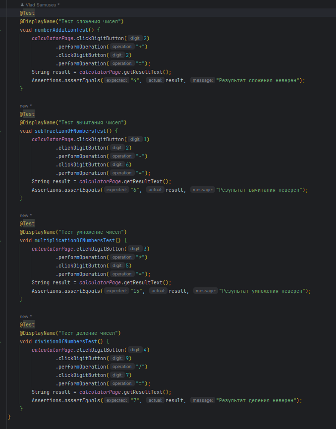
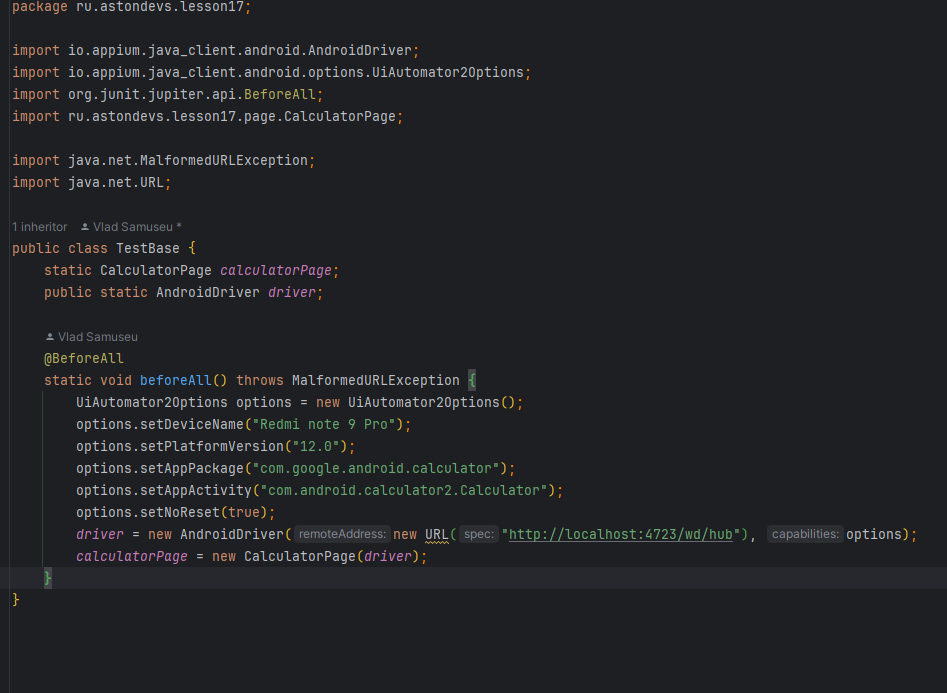
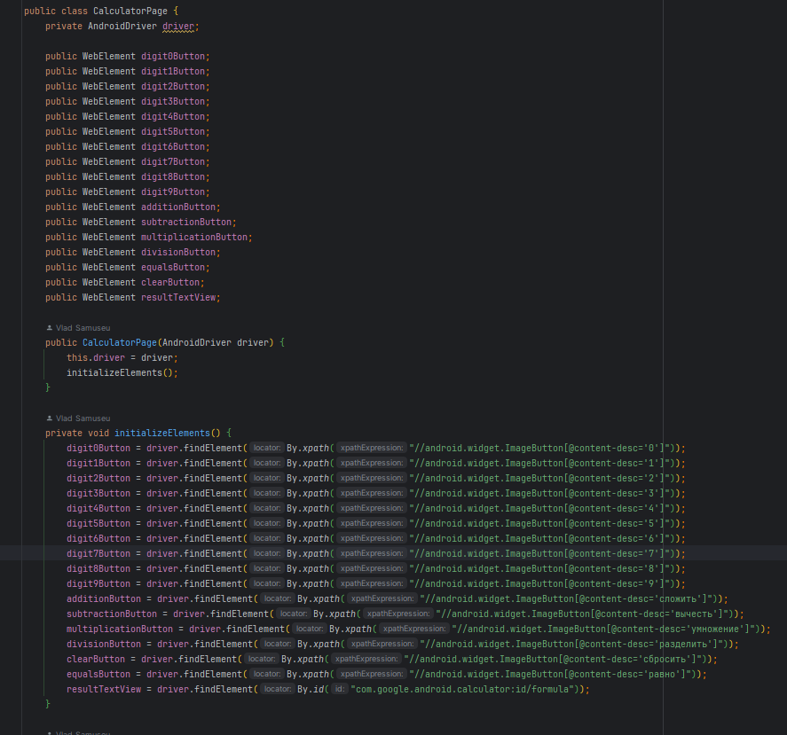
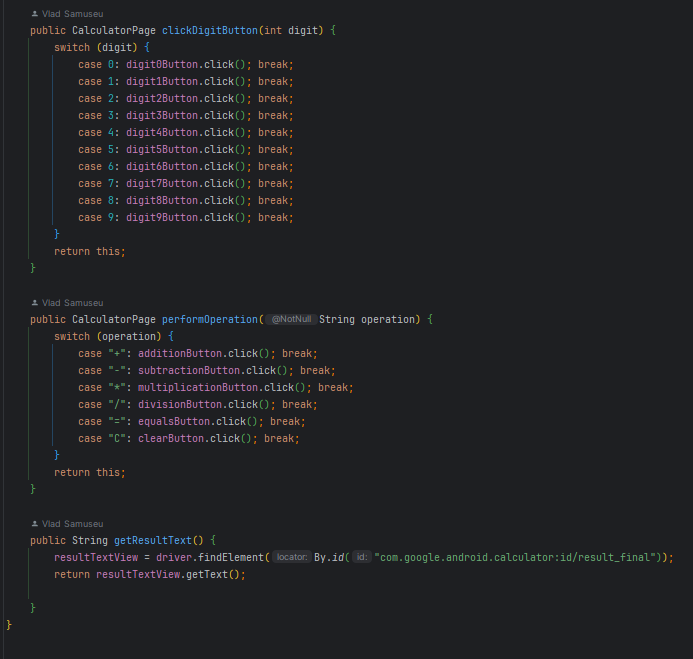
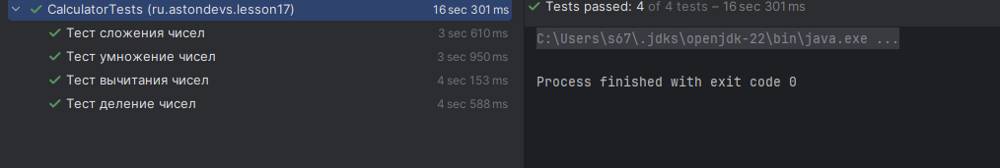

&nbsp;

# [Программа курса](README.md)

## Практическое задание

**Написать автотест для калькулятора, который совершает
арифметические действия (сложение, вычитание,
умножение и деление) и проверяет, что результат,
отображаемый на экране соответствует ожидаемому (для
теста взять приложение «Калькулятор» от Google).**

**Необходимо помимо решения приложить видеоподтверждение того, что тест проходит (удачное
прохождение в среде разработки и видео с экрана телефона
или эмулятора(для эмулятора можно сделать одно видео, на
котором виден сам эмулятор и прохождение теста в среде
разработки). Способ передачи видео следует обговорить с
проверяющим.**

#### **Пример видеозаписи прохождения теста**

#### **Выполнение**

#### **Результат**
