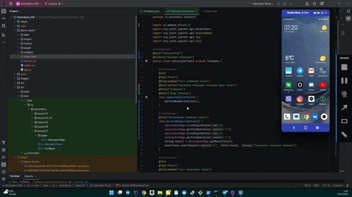
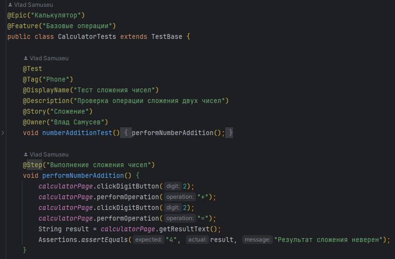
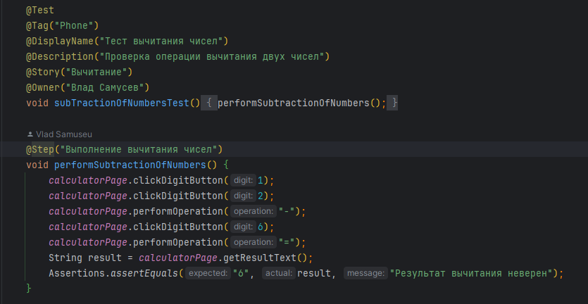
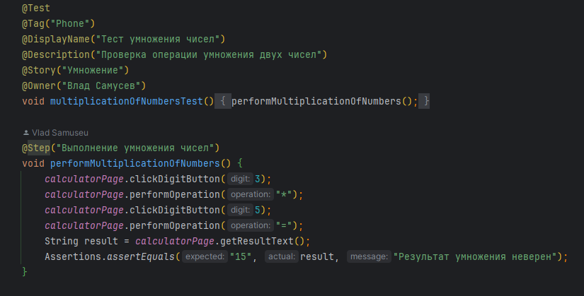
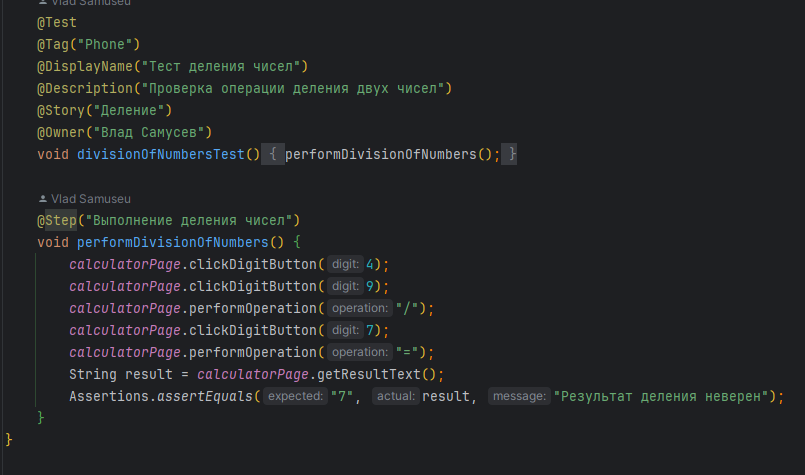
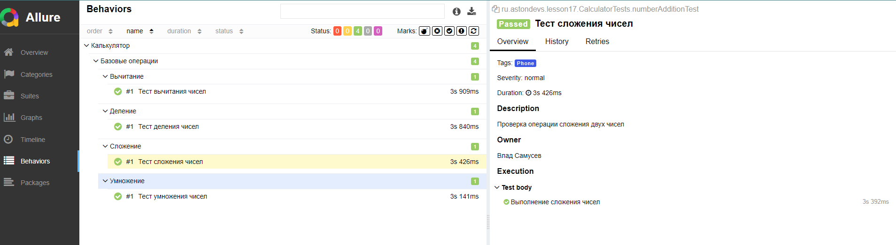

&nbsp;

# [Программа курса](README.md)

## Практическое задание

**Необходимо взять тест из практического задания в теме 17
и добавить Allure-репорт.
Решение необходимо дополнить видео с прогоном теста и
генерацией отчета в Allure.**

#### **Пример видеозаписи прохождения теста,а если долго грузится вот прямая ссылка**  [Видео](https://github.com/Samuseu/Astondevs_HW/tree/Lesson_18/images/lesson_18/lesson_18_1.gif)

#### **Выполнение**

#### **Результат**
