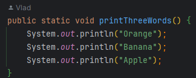
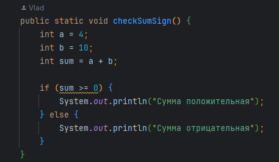
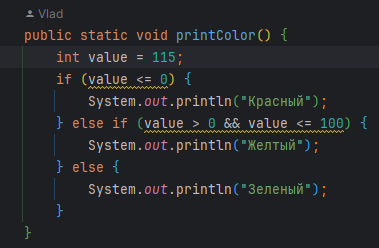
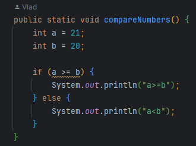
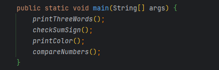
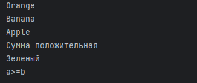
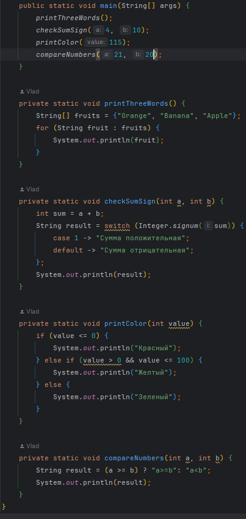

&nbsp;

# [Программа курса](README.md)

## Практическое задание

1. Создайте метод printThreeWords() , который при вызоведолжен отпечатать в столбец три слова: Orange, Banana,Apple.
   

2. Создайте метод checkSumSign(), в теле которого объявите две int переменные a и b, и инициализируйте их любыми
   значениями, которыми захотите. Далее метод должен просуммировать эти переменные, и если их сумма больше или равна 0,
   то вывести в консоль сообщение “Сумма положительная”, в противном случае - “Сумма отрицательная”;
   

3. Создайте метод printColor() в теле которого задайте int переменную value и инициализируйте ее любым значением. Если
   value меньше 0 (0 включительно), то в консоль метод должен вывести сообщение “Красный”, если лежит в пределах от 0 (0
   исключительно) до 100 (100 включительно), то “Желтый”, если больше 100 (100 исключительно) - “Зеленый”;
   

4. Создайте метод compareNumbers(), в теле которого объявите две int переменные a и b, и инициализируйте их любыми
   значениями, которыми захотите. Если a больше или равно b, то необходимо вывести в консоль сообщение “a >= b”, в
   противном случае “a < b”;
   

5. Методы из пунктов 1-5 вызовите из метода main() и посмотрите корректно ли они работают.
   

- *Вот тут другие реализации данного задания ->* [Result.java](src/main/java/ru/astondevs/lesson2/moreoptions/Result.java)
  

