&nbsp;

# [Программа курса](README.md)

## Практическое задание

1. Написать метод, принимающий на вход два целых числа и проверяющий, что их сумма лежит в пределах от 10 до 20 (
   включительно), если да – вернуть true, в противном случае – false.

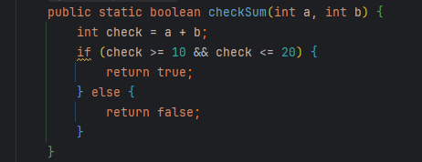

2. Написать метод, которому в качестве параметра передается целое число, метод должен напечатать в консоль,
   положительное ли число передали или отрицательное. Замечание: ноль считаем положительным числом.

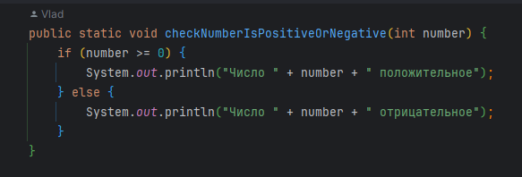

3. Написать метод, которому в качестве параметра передается целое число. Метод должен вернуть true, если число
   отрицательное, и вернуть false если положительное.

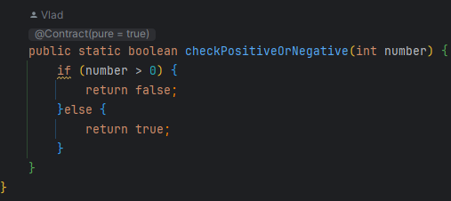

4. Написать метод, которому в качестве аргументов передается строка и число, метод должен отпечатать в консоль указанную
   строку, указанное количество раз.

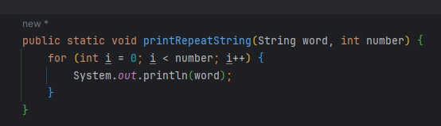

5. Написать метод, который определяет, является ли год високосным, и возвращает boolean (високосный - true, не
   високосный - false). Каждый 4-й год является високосным, кроме каждого 100-го, при этом каждый 400-й –
   високосный.

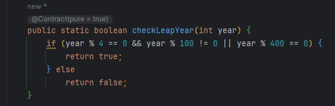

6. Задать целочисленный массив, состоящий из элементов 0 и 1. Например: [ 1, 1, 0, 0, 1, 0, 1, 1, 0, 0 ]. С помощью
   цикла и условия заменить 0 на 1, 1 на 0;

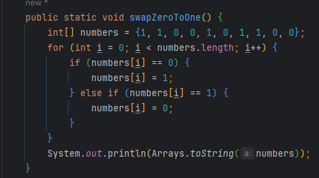

7. Задать пустой целочисленный массив длиной 100. С помощью цикла заполнить его значениями 1 2 3 4 5 6 7 8 ... 100;

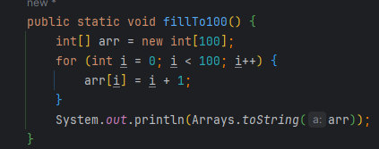

8. Задать массив [ 1, 5, 3, 2, 11, 4, 5, 2, 4, 8, 9, 1 ] пройти по нему циклом, и числа меньшие 6 умножить на 2;

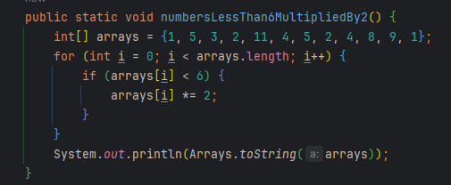

9. Создать квадратный двумерный целочисленный массив (количество строк и столбцов одинаковое), и с помощью цикла(-ов)
   заполнить его диагональные элементы единицами (можно только одну из диагоналей, если обе сложно). Определить
   элементы одной из диагоналей можно по следующему принципу: индексы таких элементов равны, то
   есть [0][0], [1][1], [2][2], ..., [n][n];

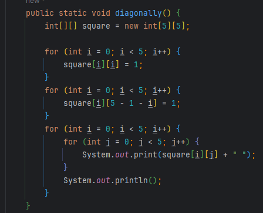

10. Написать метод, принимающий на вход два аргумента: len и initialValue, и возвращающий одномерный массив типа int
    длиной len, каждая ячейка которого равна initialValue.

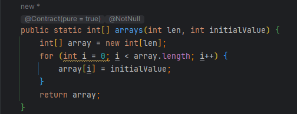
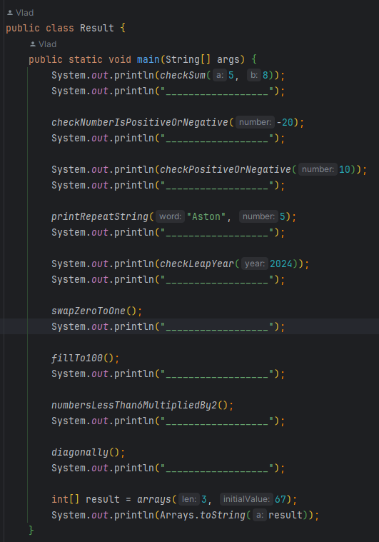

- *Вот тут другие реализации данного
  задания ->* [Result.java](src/main/java/ru/astondevs/lesson3/moreoptions/Result.java)

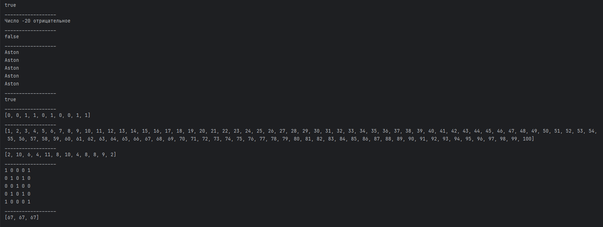

