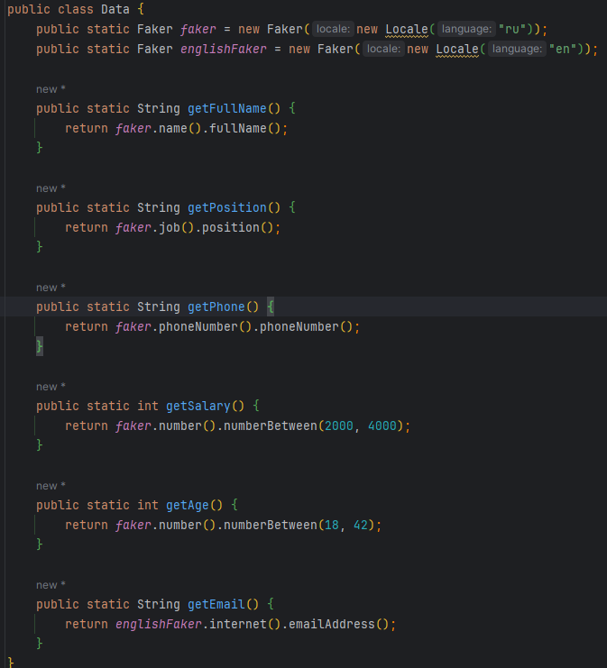
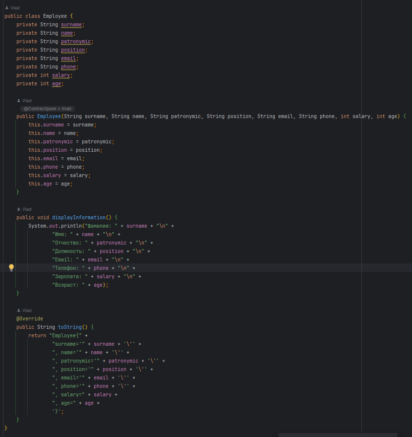
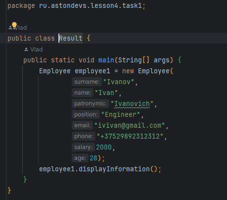
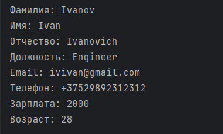
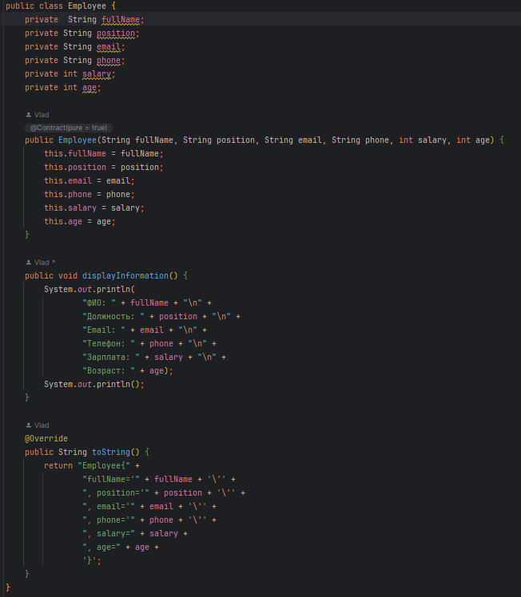
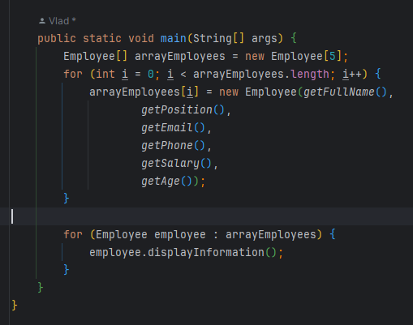
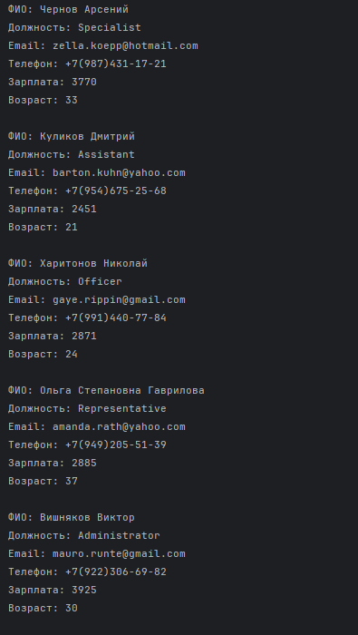
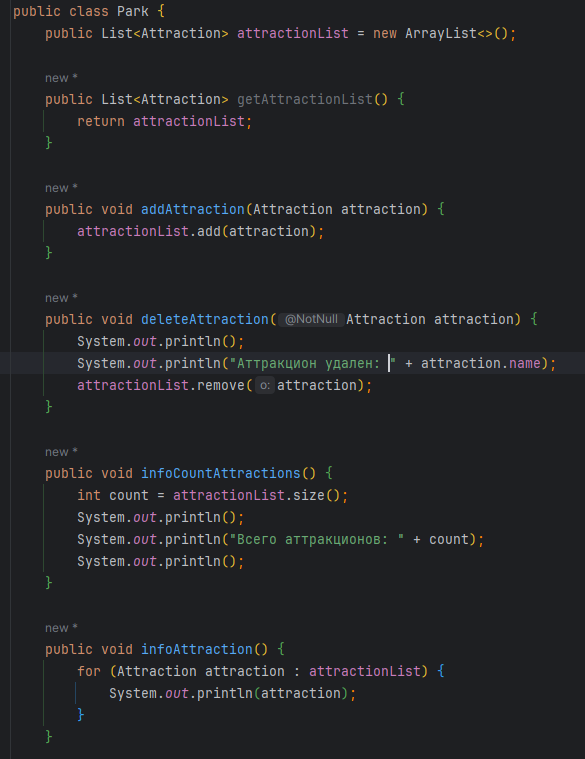
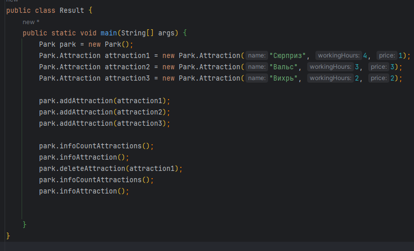
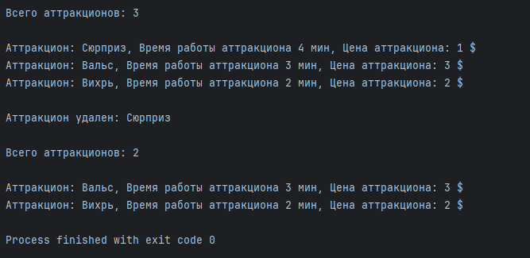

&nbsp;

# [Программа курса](README.md)

## Практическое задание

> **В данном задании я использовал библиотеку -> [java-faker](https://github.com/Samuseu/java-faker)**
> 
> **Вот класс в котором реализован faker [Data](src/main/java/ru/astondevs/lesson4/Data.java)**

>

1. **Создать класс "Сотрудник" с полями: ФИО, должность, email, телефон, зарплата, возраст. Конструктор класса должен
   заполнять эти поля при создании объекта. Внутри класса «Сотрудник» написать метод, который выводит информацию об
   объекте в консоль.**

#### **Выполнение**

   

#### **Результат**

2. **Создать массив из 5 сотрудников. Пример: // вначале объявляем массив объектов Person[] persArray = new
   Person[5]; // потом для каждой ячейки массива задаем объект persArray[0] = new Person("Ivanov Ivan", "Engineer", "
   ivivan@mailbox.com", "892312312", 30000, 30); persArray[1] = new Person(...); ... persArray[4] = new Person(...);**

#### **Выполнение**

 

#### **Результат**

3. **Создать класс Park с внутренним классом, с помощью объектов которого можно хранить информацию об аттракционах,
   времени их работы и стоимости.**

#### **Выполнение**

  

#### **Результат**

> ### Вот тут другие реализации данного задания -> [MoreOptions](src/main/java/ru/astondevs/lesson4/moreoptions)
