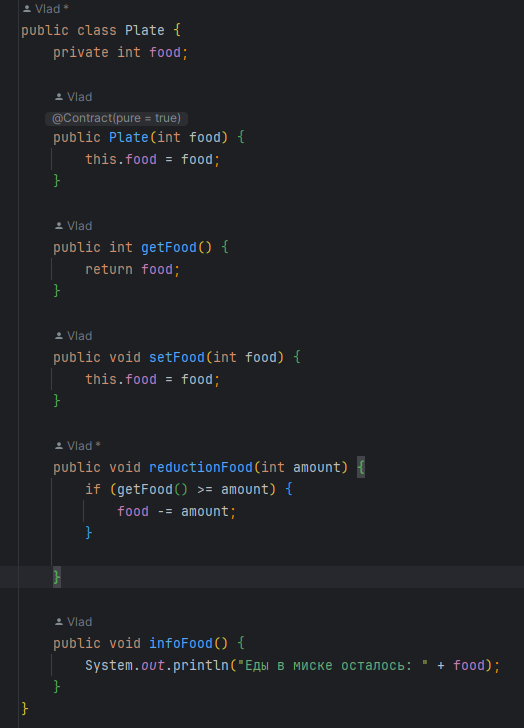
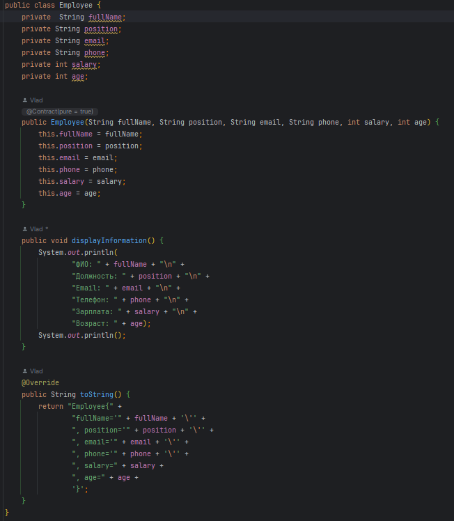
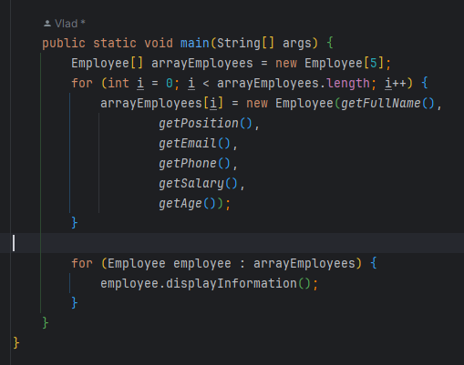
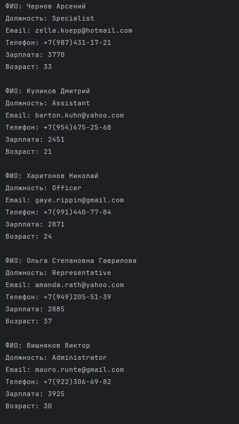
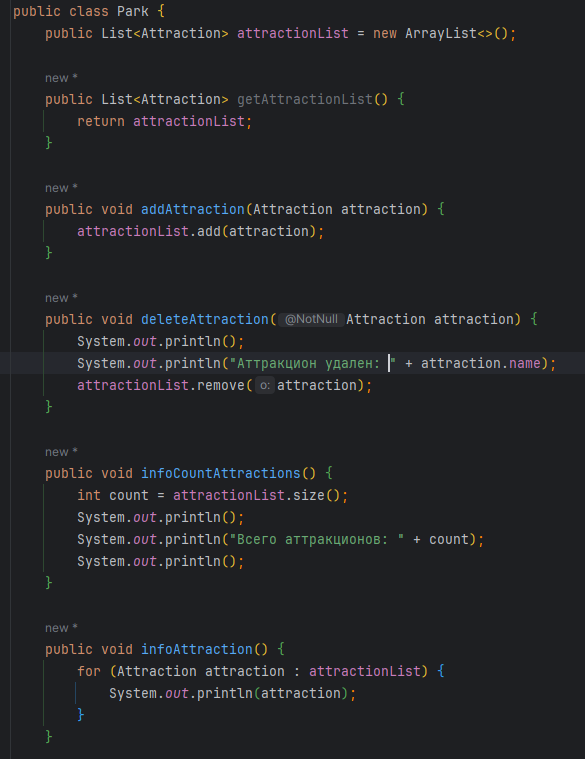
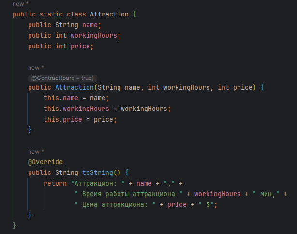
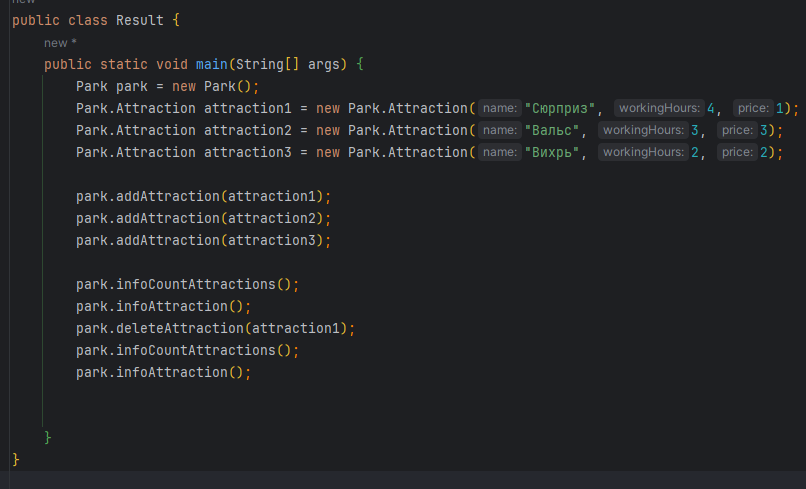
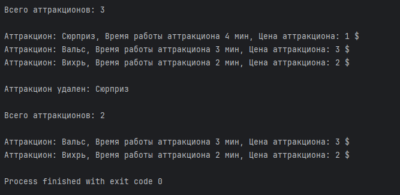

&nbsp;

# [Программа курса](README.md)

## Практическое задание

1. **Создать классы Собака и Кот с наследованием от класса Животное.**
**Все животные могут бежать и плыть. В качестве параметра каждому методу передается длина препятствия. Результатом выполнения действия будет печать в консоль. (Например, dogBobik.run(150); -> 'Бобик пробежал 150 м.');** **У каждого животного есть ограничения на действия (бег: кот 200 м., собака 500 м.; плавание: кот не умеет плавать, собака 10 м.).**
**Добавить подсчет созданных котов, собак и животных.**

**Расширить задачу, добавив для котов возможность кушать из миски, выполнив следующие пункты:**

- Сделать так, чтобы в миске с едой не могло получиться отрицательного количества еды (например, в миске 10 еды, а кот пытается покушать 15-20).
- Каждому коту нужно добавить поле сытость (когда создаем котов, они голодны). Если коту удалось покушать (хватило еды), сытость = true.
- Считаем, что если коту мало еды в миске, то он её просто не трогает, то есть не может быть наполовину сыт (это сделано для упрощения логики программы).
- Создать массив котов и миску с едой, попросить всех котов покушать из этой миски и потом вывести информацию о сытости котов в консоль.
- Добавить метод, с помощью которого можно было бы добавлять еду в миску.

#### **Выполнение**

 

 

 

 

 

#### **Результат**

2. **Применяя интерфейсы написать программу расчета периметра и площади геометрических фигур:**
   - круг 
   - прямоугольник 
   - треугольник
   
**Задать для каждой фигуры цвет заливки и цвет границы.
   Результат полученных характеристик [ Периметр, площадь, цвет фона, цвет границ ] по каждой
   фигуре вывести в консоль.
   Попробуйте реализовать базовые методы, такие как расчет периметра фигур, в качестве
   дефолтных методов в интерфейсе.**

#### **Выполнение**

 

#### **Результат**

3. **Создать класс Park с внутренним классом, с помощью объектов которого можно хранить информацию об аттракционах,
   времени их работы и стоимости.**

#### **Выполнение**

  

#### **Результат**

> ### Вот тут другие реализации данного задания -> [MoreOptions](src/main/java/ru/astondevs/lesson4/moreoptions)
