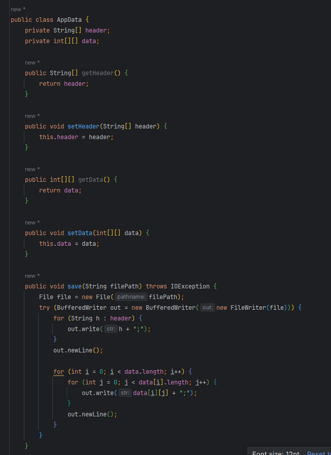
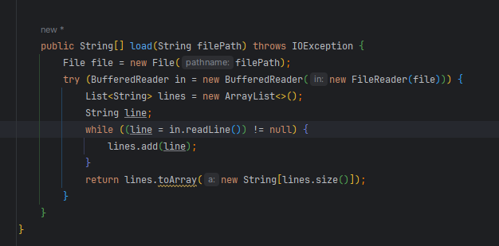
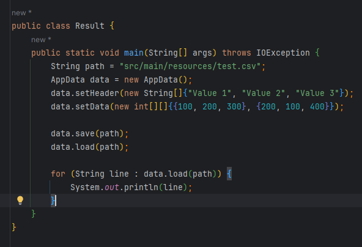
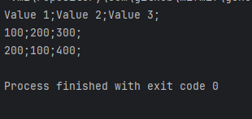

&nbsp;

# [Программа курса](README.md)

## Практическое задание

1. **Реализовать сохранение данных в csv файл;**
2. **Реализовать загрузку данных из csv файла. Файл читается целиком.**

#### **Выполнение**

#### **Результат**

