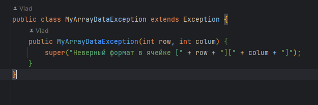
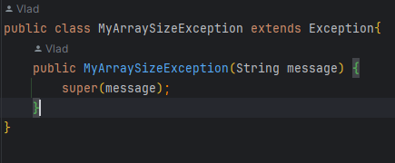
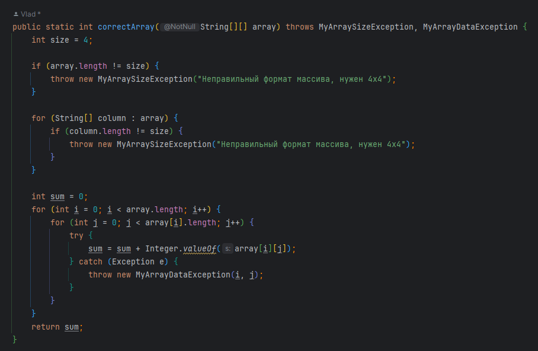
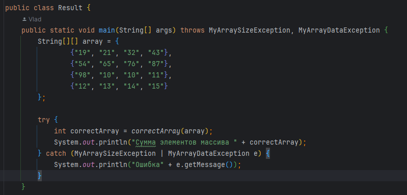
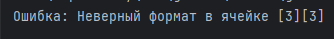
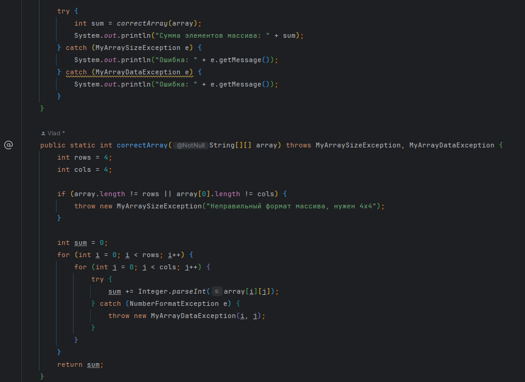

&nbsp;

# [Программа курса](README.md)

## Практическое задание

1. **Напишите метод, на вход которого подаётся двумерный строковый массив размером 4х4. При подаче массива другого размера
   необходимо бросить исключение MyArraySizeException.**
2. **Далее метод должен пройтись по всем элементам массива, преобразовать в int и просуммировать. Если в каком-то элементе массива преобразование не удалось (например, в ячейке лежит символ или текст вместо числа), должно быть брошено исключение MyArrayDataException с детализацией, в какой именно ячейке лежат
   неверные данные.**
3. **В методе main() вызвать полученный метод, обработать возможные исключения MyArraySizeException и MyArrayDataException и
   вывести результат расчета.**

#### **Выполнение**

#### **Результат**

#### **Ошибочный результат**

> ### Вот тут другие реализации данного задания -> [MoreOptions](src/main/java/ru/astondevs/lesson7/moreoptions)

