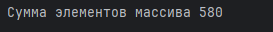

&nbsp;

# [Программа курса](README.md)

## Практическое задание

1. **Создать массив с набором слов (10-20 слов, должны встречаться
   повторяющиеся). Найти и вывести список уникальных слов, из
   которых состоит массив (дубликаты не считаем). Посчитать,
   сколько раз встречается каждое слово. (реализовать с
   использованием коллекций)**

#### **Выполнение**

#### **Результат**

2. **Написать простой класс Телефонный Справочник, который хранит в
   себе список фамилий и телефонных номеров. В этот телефонный
   справочник с помощью метода аdd() можно добавлять записи, а с
   помощью метода gеt() искать номер телефона по фамилии. Следует
   учесть, что под одной фамилией может быть несколько телефонов
   (в случае однофамильцев), тогда при запросе такой фамилии должны выводиться все телефоны.**

#### **Выполнение**

#### **Результат**

