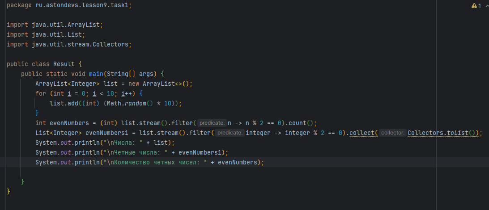
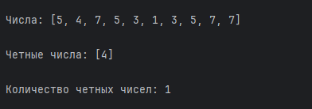
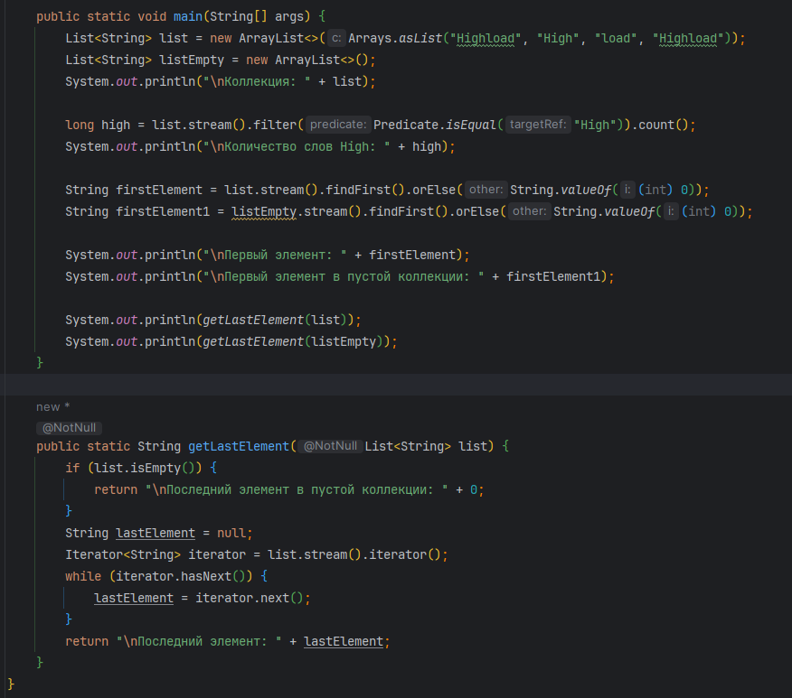
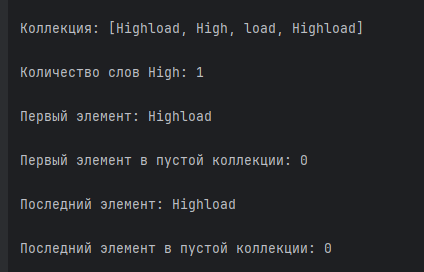
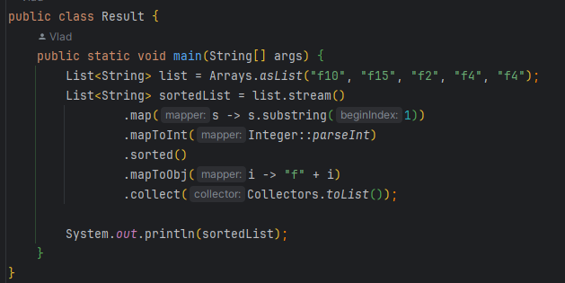
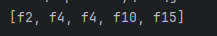
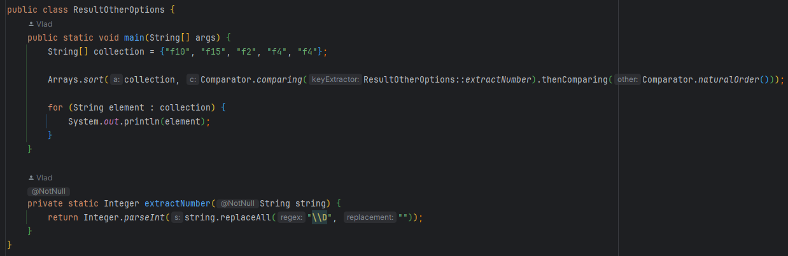
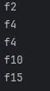

&nbsp;

# [Программа курса](README.md)

## Практическое задание

1. **Для любого набора случайно-сгенерированных чисел нужно определить количество чётных чисел.**

#### **Выполнение**

#### **Результат**

2. **Задана коллекция, состоящая из строк: «Highload», «High», «load»,
   «Highload». Нужно с ней выполнить следующие манипуляции:**
- **Посчитать, сколько раз объект «High» встречается в коллекции;**
- **Определить, какой элемент в коллекции находится на первом месте. Если мы получили пустую коллекцию, то пусть
  возвращается 0;**
- **Необходимо вернуть последний элемент, если получили пустую коллекцию, то пусть возвращается 0;**

#### **Выполнение**

#### **Результат**

3. **Задана коллекция, содержащая элементы "f10", "f15", "f2", "f4", "f4".
   Необходимо отсортировать строки в алфавитном порядке и добавить их в массив;**

#### **Выполнение**

#### **Результат**

#### **Выполнение другим способом**

#### **Результат**

4. **Создать класс Student**
- **Необходимо узнать средний возраст студентов мужского пола;**
- **Кому из студентов грозит получение повестки в этом году при условии, что призывной возраст установлен в диапазоне от 18 до 27 лет;**

#### **Выполнение**

#### **Результат**

5. **Нужно написать программу, которая будет принимать от
   пользователя ввод различных логинов. Как только пользователь введет
   пустую строку - программа должна прекратить приём данных от
   пользователя и вывести в консоль логины, начинающиеся на букву f (строчную).**

#### **Выполнение**

#### **Результат**